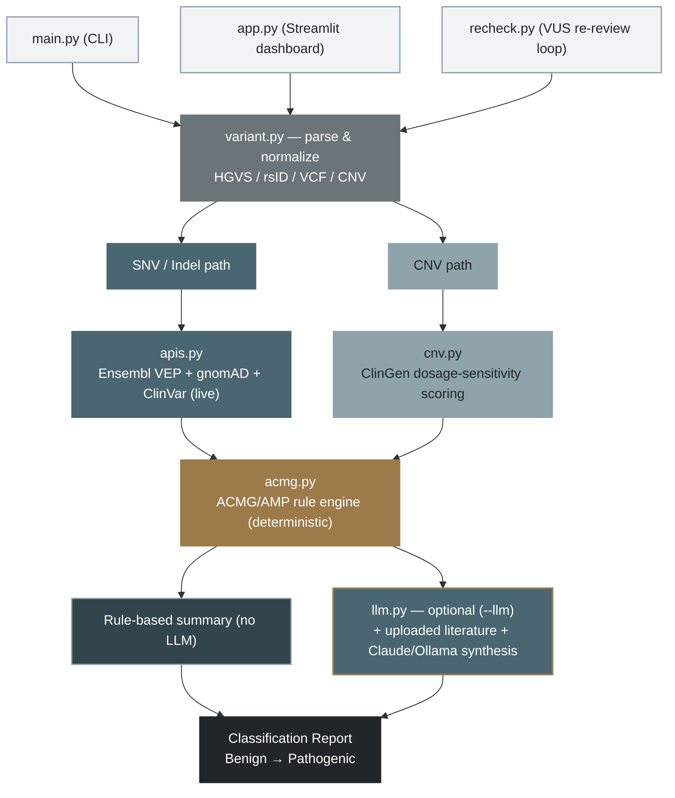

# AI-CURA Prototype

A prototype implementation of the **AI-CURA** framework — an automated LLM workflow for genetic variant classification following **ACMG/AMP 2015 guidelines**.

> Based on: Ma et al., *"AI-CURA, an automated LLM workflow for high-accuracy genetic variant classification"*, Science Translational Medicine, 2025.

---

## What it does

Given a variant (SNV, indel, or CNV), AI-CURA:

1. **Annotates** the variant using [Ensembl VEP](https://rest.ensembl.org) (consequence, SIFT, PolyPhen)
2. **Fetches population frequency** from [gnomAD](https://gnomad.broadinstitute.org)
3. **Searches ClinVar** for existing classifications
4. **Applies ACMG/AMP criteria** (PVS1, PS1, PM2, PP3/BP4, PP5/BP6, BA1, BS1)
5. **Synthesizes** a clinical interpretation via Claude (optional, with `--llm`)

---

## ACMG Criteria Implemented

| Code | Strength | Direction | Rule |
|------|----------|-----------|------|
| PVS1 | Very Strong | Pathogenic | Null variant (frameshift, nonsense, splice) |
| PS1  | Strong      | Pathogenic | Same AA change as known pathogenic (ClinVar) |
| PM2  | Moderate    | Pathogenic | Absent / very low frequency in gnomAD (AF < 0.001) |
| PP3  | Supporting  | Pathogenic | SIFT + PolyPhen both predict damaging |
| PP5  | Supporting  | Pathogenic | ClinVar reports pathogenic |
| BA1  | Stand-alone | Benign     | AF > 5% in gnomAD |
| BS1  | Strong      | Benign     | AF > 1% in gnomAD |
| BP4  | Supporting  | Benign     | SIFT + PolyPhen both predict benign |
| BP6  | Supporting  | Benign     | ClinVar reports benign |

---

## Installation

```bash
git clone https://github.com/YOUR_USERNAME/ai-cura-prototype
cd ai-cura-prototype

pip install -r requirements.txt

# Optional: copy and fill in your API keys
cp .env.example .env
```

---

## Usage

```bash
# BRCA1 known pathogenic frameshift
python main.py --variant "NM_007294.4:c.5266dupC"

# Via rsID
python main.py --variant "rs80357906"

# VCF format (chromosome-position-ref-alt)
python main.py --variant "chr17-41234470-G-A"

# CNV deletion
python main.py --variant "chr17-1000000-5000000-DEL"

# Enable LLM synthesis (needs ANTHROPIC_API_KEY)
python main.py --variant "NM_007294.4:c.5266dupC" --llm

# JSON output (pipe into other tools)
python main.py --variant "rs80357906" --output json
```

### Options

| Flag | Description |
|------|-------------|
| `--variant` / `-v` | Variant string (required) |
| `--genome` | `GRCh37` or `GRCh38` (default: GRCh38) |
| `--llm` | Enable Claude LLM synthesis (requires `ANTHROPIC_API_KEY`) |
| `--output` / `-o` | `text` (default) or `json` |

---

## Sample Output

```
╭─────────────────────────────────────────────╮
│           AI-CURA Classification Result      │
│ Variant: NM_007294.4:c.5266dupC             │
│                                              │
│            Pathogenic                        │
╰─────────────────────────────────────────────╯

  Gene        BRCA1
  HGVS c.     NM_007294.4:c.5266dupC
  HGVS p.     p.Gln1756ProfsTer74
  Consequence frameshift_variant
  gnomAD AF   not found

  ACMG/AMP Criteria
  ┌──────┬────────┬─────────────┬────────────┬─────────────────────────┐
  │ Code │ Status │ Strength    │ Direction  │ Evidence                │
  ├──────┼────────┼─────────────┼────────────┼─────────────────────────┤
  │ PVS1 │ ✓ MET  │ very strong │ pathogenic │ frameshift_variant      │
  │ PM2  │ ✓ MET  │ moderate    │ pathogenic │ Absent from gnomAD      │
  │ PP5  │ ✓ MET  │ supporting  │ pathogenic │ ClinVar: Pathogenic     │
  │ BA1  │ ✗      │ stand alone │ benign     │ not found in gnomAD     │
  └──────┴────────┴─────────────┴────────────┴─────────────────────────┘
```

---

## Limitations (important for interviews!)

- **PS1** (same AA change) is approximated via ClinVar search, not a proper amino acid comparison
- **PP3/BP4** use only SIFT + PolyPhen; the original AI-CURA uses more tools (CADD, REVEL, SpliceAI)
- **CNV classification** uses ClinGen guidelines (Riggs et al. 2020), which differ from SNV ACMG rules; only a ClinVar lookup is performed in this prototype
- LLM synthesis (**--llm**) requires an Anthropic API key and uses `claude-haiku` for speed
- No local database; all data is fetched live from public APIs (requires internet)
- HGVS parsing is best-effort; complex variants may need normalization first

---

## Architecture

A variant enters through one of three surfaces — the CLI, the Streamlit dashboard, or the scheduled VUS re-review loop — and is parsed and normalized first. It then splits by variant type: SNVs/indels are annotated live against Ensembl VEP, gnomAD, and ClinVar, while CNVs go through a separate ClinGen dosage-scoring path. Both paths converge on one deterministic ACMG/AMP rule engine — the same inputs always produce the same rule outcome, with no LLM involved. From there, the default output is a rule-based summary; passing `--llm` additionally folds in any uploaded literature and has Claude or a local Ollama model synthesize a plain-English explanation of the evidence that's already been scored — the LLM only narrates, it never re-scores. Both paths converge on one final classification, from Benign to Pathogenic.



**Module reference**

```
main.py                  ← CLI entry point (rich terminal output)
app.py                   ← Streamlit web dashboard
recheck.py               ← VUS re-review loop (deterministic half)
src/
  variant.py             ← Input parsing (HGVS / VCF / rsID / CNV)
  apis.py                ← Ensembl VEP, gnomAD, ClinVar clients (SNV/indel path)
  cnv.py                 ← ClinGen dosage-sensitivity scoring (CNV path)
  acmg.py                ← ACMG/AMP criteria engine
  classifier.py          ← Orchestration pipeline
  llm.py                 ← Claude / Ollama synthesis layer (optional)
```

---

## Roadmap (future work)

- [ ] Add SpliceAI for splice variant scoring (PVS1 refinement)
- [ ] Add CADD / REVEL scores (PP3/BP4 improvement)
- [ ] Implement full ClinGen CNV scoring (gene HI/TS scores, DECIPHER overlap)
- [ ] Literature search via PubMed API + LLM summarization (PM3, BS3, PS3, PS4)
- [ ] Batch processing (CSV/VCF input)
- [ ] Web UI with Flask/FastAPI

---

## References

- Richards et al. (2015). *Standards and guidelines for the interpretation of sequence variants.* Genetics in Medicine, 17(5), 405–424.
- Ma et al. (2025). *AI-CURA, an automated LLM workflow for high-accuracy genetic variant classification.* Science Translational Medicine.
- Riggs et al. (2020). *Technical standards for the interpretation and reporting of constitutional copy-number variants.* Genetics in Medicine.
